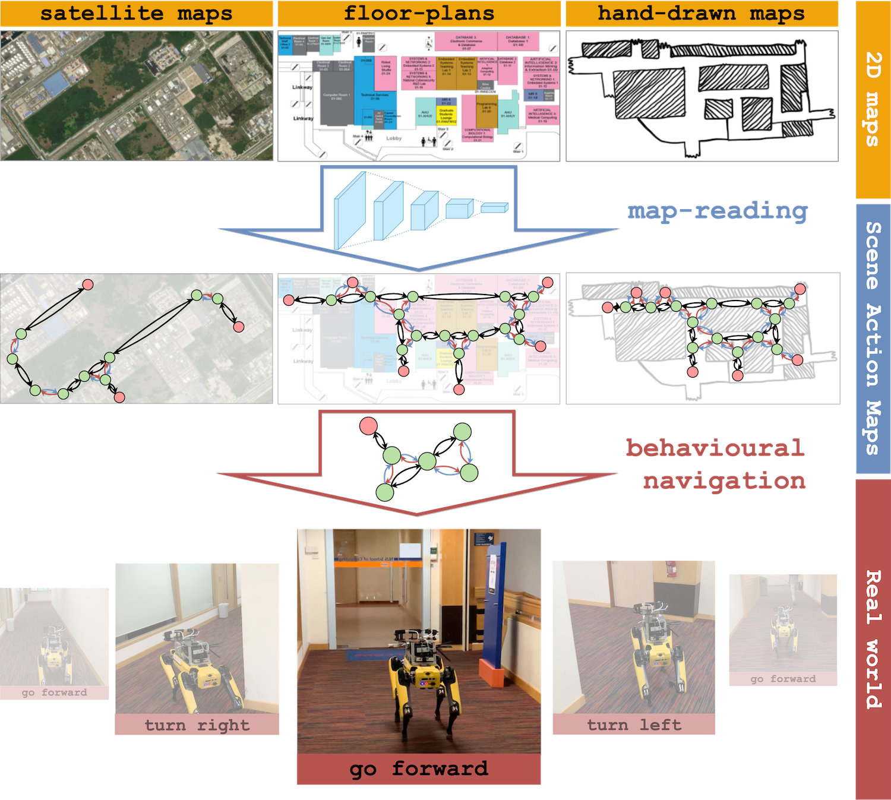

# Scene Action Maps

<p align="center">
    
</p>

This repository contains code to generate Scene Action Maps from various map sources, such as satellite maps. To construct a full robot system as shown in our paper, we also need the following components:

* [Graph Localization Network](https://github.com/kchen92/graphnav)
* Behavioural controller, e.g. [DECISION](https://github.com/AdaCompNUS/DECISION) or [GraphNav's](https://github.com/kchen92/graphnav)

## Installing dependencies
```
pip install torch torchvision pytorch-lightning scipy scikit-learn matplotlib
```

## Training
### Data
The maps/ directory provides map data from locations in Singapore. For each location, we provide a map image, and a hand-annotated SAM, which can be read as a BehaviourGraph (`structures.py`).

We also provide a complete training dataset, sampled from the nodes and edges maps of each map type. E.g., maps/satmap/changepoint_samples.npz and maps/satmap/edge_matching_samples.npz. Training datasets can be generated for a custom map type using the script
```
python sample_data.py --map_type maps/<custom_map_type>
```

### Training
We provide scripts for training the changepoint predictors and edge matching predictors described in the paper. We empirically find that contrastive representation learning bootstraps performance. To train a changepoint predictor, we recommend first training a good latent visual representation suitable for changepoint prediction:
```
python train_changepoint_repr.py --dataset_dir <path/to/dataset> --model_dir <path/to/save/model>
```
A changepoint predictor can be trained either with a randomly initialized encoder, or the learned encoder above:
```
python train_changepoint.py --dataset_dir <path/to/dataset> --model_dir <path/to/save/model> --model_name <encoder_filename>
```
The edge matching predictor can be trained similarly using `train_edge_matcher_repr.py` and `train_edge_matcher.py`

## Generating graphs
Given learned models for changepoint prediction and edge matching, we can build a SAM:
```
python build_graph.py --dataset_dir <path/to/dataset> --changepoint_model <path/to/changepoint/model> --edge_model <path/to/edge/matching/model>
```

SAMs can be read in as BehaviourGraphs (`structures.py`) and visualised using `habitat_map_editor.py`.